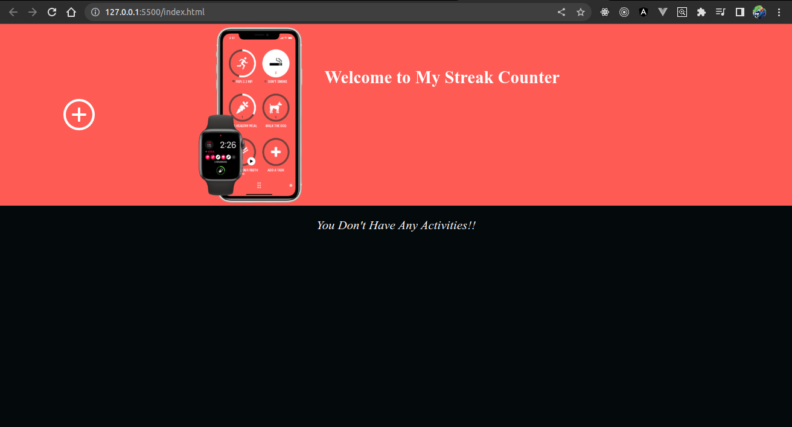
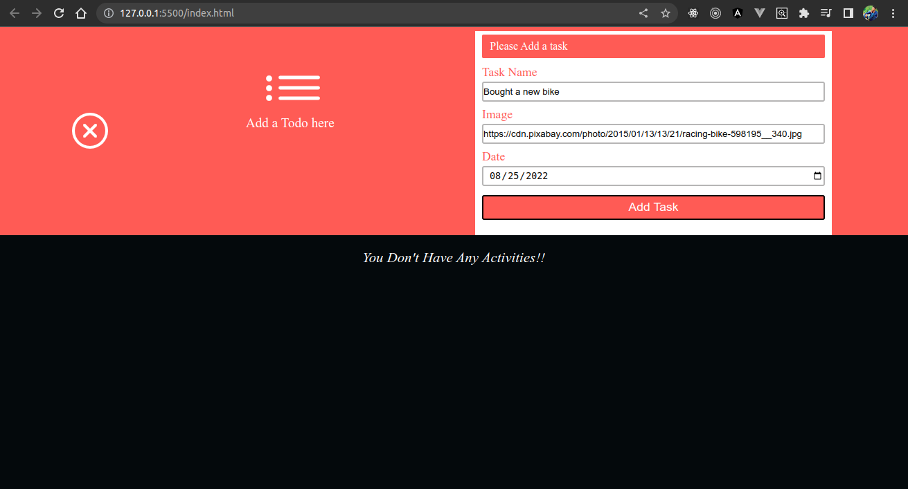
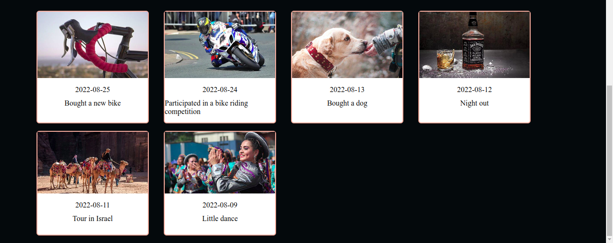
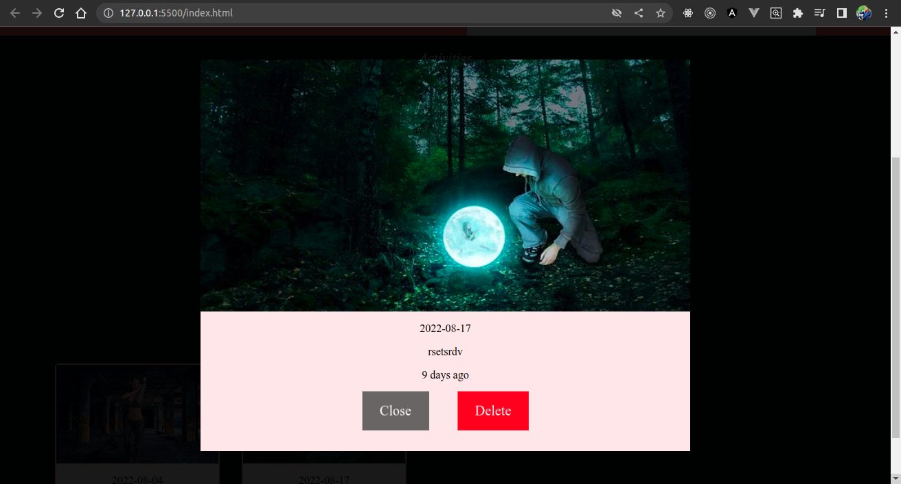

# streak-counter
A streak counter project

# [Demo](https://jitu-streak-counter.vercel.app/)

## Features
- Add an activity
- Filter best activity depending on the day you added it. The more the number of days an activity has, the better it is.
- If you delete the best activity, pick the next best one and synchronize the DOM.
- When an activity is clicked, show a modal with that activity's details.
- Toggle hero image and form to add an activity.
- If no activities yet, show a message. Else show a message saying there are activities
- If added an activities successfully, show a success message for 5 seconds.

## Home page

## Form to add a new activity

## Show best activity here

## Display all activities below the best activity

## This is the modal of an activity

